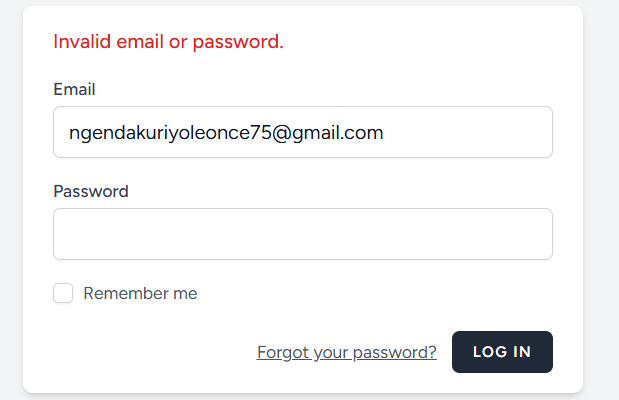
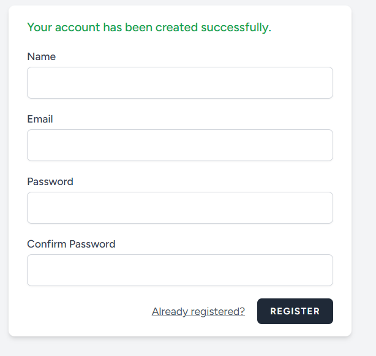
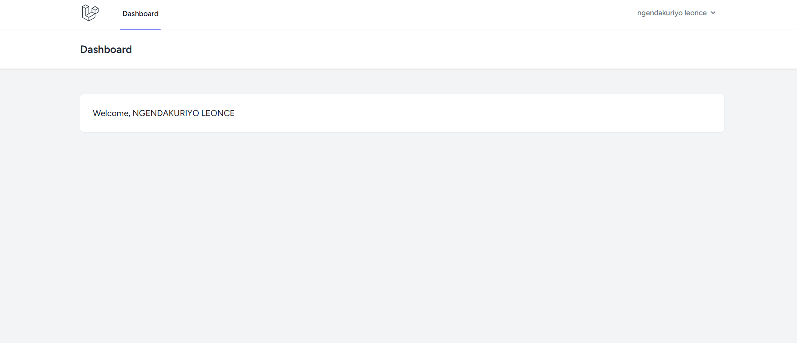
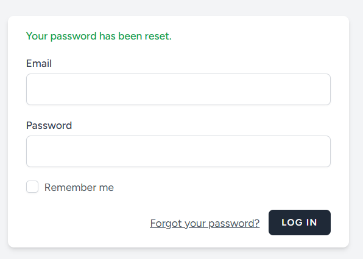

# User Dashboard System

Authentication system built with Laravel Breeze.

## Features

- User Registration
- User Login
- User Logout
- Protected Dashboard
- Password Reset
- User Authentication
- Welcome Authenticated User
- Customized Success Messages
- Customized Error Messages

---

## Technologies Used

- PHP
- Laravel
- Laravel Breeze
- Blade
- Tailwind CSS
- MySQL

---

## Customizations

### Dashboard Welcome Message

The dashboard displays a personalized welcome message for the authenticated user.

Example:

```php
Welcome, {{ Auth::user()->name }}
```

---

### Customized Success Messages

Modified authentication success messages for a better user experience.

Examples:

- Login success
- Password reset link sent
- Registration success

---

### Customized Error Messages

Customized validation and authentication error messages.

Examples:

- Invalid credentials
- Required fields
- Password confirmation errors

---

## Authentication Features

### Register

Users can create a new account securely.

### Login

Authenticated users can log into the system.

### Logout

Users can safely log out from the application.

### Forgot Password

Users can request a password reset link via email.

### Protected Dashboard

Only authenticated users can access the dashboard.


# Screenshots

## Login Page



---

## Register Page



---

## Dashboard



---

## Forgot Password



---

## Installation

```bash
git clone https://github.com/ngendakuriyoleonce/breeze.git

cd project-name

composer install

npm install && npm run dev

cp .env.example .env

php artisan key:generate

php artisan migrate

php artisan serve
```

---

## Author

NGENDAKURIYO LEONCE
